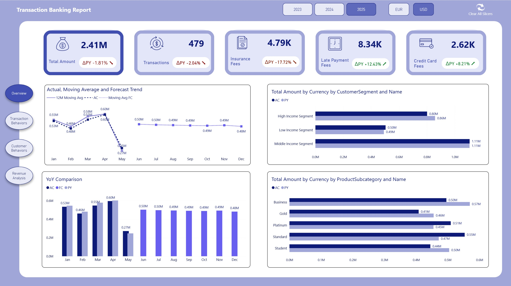

# Transaction Banking Analytics – Financial Performance & Customer Behavior Analysis

This project is a Power BI financial analytics solution built to analyze transaction volumes, revenue, fees, customer behavior, and product performance in a retail banking environment.  
The report is designed for executive-level monitoring as well as detailed exploratory analysis using advanced visuals, time intelligence, and semantic modeling techniques.

## Project Objectives

- Analyze total transaction volume, revenue, and banking fees across products and customer segments  
- Monitor financial performance using Year-over-Year (YoY), Prior Year (PY), and Moving Average metrics  
- Forecast future financial trends to support proactive decision-making  
- Identify customer behavior drivers using advanced visual decomposition techniques  
- Enable deep-dive analysis across products, channels, segments, and time  

## Analytical Techniques

### Decomposition Tree (Advanced Visual Technique)

Used extensively to analyze Total Revenue and Fees by dynamically breaking them down across:
- Product Category  
- Customer Segment  
- Channel  
- Individual Products  

This allows users to interactively explore *why* a metric is high or low, not just *what* the number is.  
The Decomposition Tree enables true root-cause analysis by letting users drill into multiple dimensions without creating dozens of separate visuals.

### Time Intelligence & Forecasting

- Year-over-Year (YoY) and Prior Year (PY) calculations applied consistently across all KPIs  
- 12-Month Moving Average to smooth volatility and highlight long-term trends  
- Forecasting applied to key financial metrics to provide forward-looking insights  

### Tabular Editor & Calculation Groups

Calculation Groups were created using Tabular Editor to centralize time intelligence logic (e.g., Actual, PY, YoY %, Moving Average).

Benefits:  
- Eliminates duplication of similar DAX logic across dozens of measures  
- Keeps the model clean, scalable, and easier to maintain  
- Allows seamless switching between metrics using slicers without rewriting measures  

## Tools & Technologies

- Power BI Desktop  
- DAX (Advanced Measures & Time Intelligence)  
- Tabular Editor (Calculation Groups)  
- Decomposition Tree Visual  
- Forecasting & Moving Average Analytics  
- Interactive Slicers and Drill-Down Capabilities  

## Dashboard Preview

  
  

  
  

