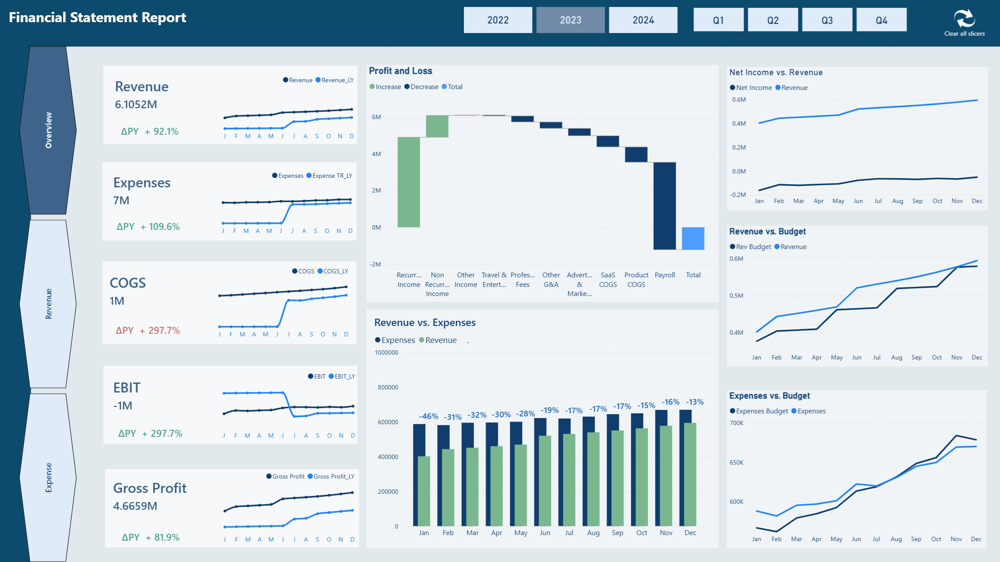
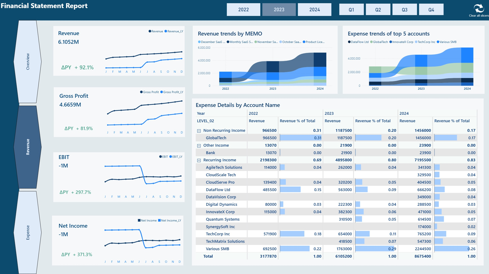
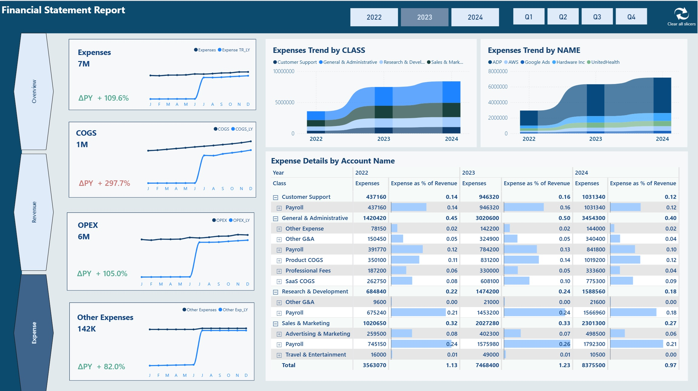

# Financial Statement Report

## 📌 Project Overview
This Power BI report provides a **financial statement view** of a SaaS-style business, showing
Revenue, COGS, OPEX, Other Expenses, EBIT, Gross Profit, and Net Income over time.

The goal is to give finance and leadership teams a clear and interactive view of **profitability,
budget vs actuals, and expense trends** across years, quarters, classes, and account names.

---

## 🎯 Business Objectives
- Monitor **Revenue, Expenses, COGS, OPEX, EBIT, Gross Profit, and Net Income** over time
- Compare **current year vs last year (ΔPY / YoY%)** for key financial metrics
- Analyze **Revenue vs Budget** and **Expenses vs Budget**
- Identify which **expense classes, vendors, and accounts** drive most of the cost
- Understand **expense and revenue trends** across years and quarters for better planning

---

## 📊 Key Metrics & KPIs

- **Revenue**
- **COGS**
- **Gross Profit**
- **OPEX**
- **EBIT**
- **Net Income**
- **Total Expenses & Other Expenses**
- **YoY% and Variance vs Prior Year**
- **Variance vs Budget (amount & %)**
- **Expense as % of Revenue**

## 🧱 Data Model & Measures

The report is built on a clean star-style model with a dedicated **Measure table** acting as
the semantic layer.

### Core Tables

- **Transaction**  
  Main fact table containing transaction-level financial data (revenue and expense amounts).

- **Accounts**  
  Chart of accounts with account-level details used for financial reporting.

- **Account Matrix / Matrix**  
  Tables that define the **financial statement structure** (e.g. Revenue, COGS, OPEX, Other
  Expenses, EBIT, Gross Profit, Net Income) and how accounts roll up into those lines.

- **Budget**  
  Budget values by account, year, and period, used for **Revenue vs Budget** and
  **Expenses vs Budget** comparisons.

- **Calendar**  
  Standard date table used for time-intelligence (Year, Quarter, Month, etc.).

### Parameter / Helper Tables

- **Parameter_Revenue**  
  Used to drive dynamic revenue-related views and measures.

- **Parameter Expense**  
  Used to control expense views and dynamic calculations.

These parameter tables help switch between different perspectives (e.g. Revenue vs Expense)
without duplicating visuals or hard-coding logic.

### Measure Table & Display Folders

All business logic is centralized in a dedicated **`Measure`** table, organized into
display folders for maintainability:

- **COGS**
- **EBIT**
- **Expenses**
- **Financial Values**
- **Gross Profit**
- **Net Income**
- **OPEX**
- **Revenue**

For example, the **Revenue** folder includes:

- `Revenue`
- `Revenue_LY`
- `Revenue YOY%`
- `Revenue % of Total`
- `Rev Budget`
- `Rev Variance`
- `Total Revenue Bar`
- `Total revenue YoY% Dynamic`
- `Delta R/E`
- `Delta R/E %`
- `Expense as % of Revenue`
- `R/E Max`

This structure makes it easy to reuse measures across visuals while keeping the logic
well-organized and aligned with financial statement concepts.

## 📈 Dashboard Preview

<h3>Overview</h3>

  

<h3>Pages (Compact View)</h3>

  
  

